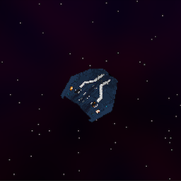
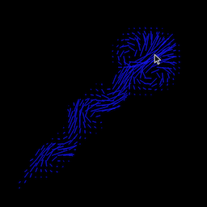

# Frank Collebrusco &nbsp; &nbsp; | &nbsp; &nbsp; [Resume](https://drive.google.com/uc?export=download&id=1JvVf30a5W-G3EooZ9gLII2dkPyc_2CC2)
             
25, Studying Computer Engineering at UT Austin, graduating Spring '25.      
See my [Graphics Library](https://github.com/collebrusco/flgl), [Entity Component System](https://github.com/collebrusco/ecs), or some of my [works](https://github.com/collebrusco/adrift) in [progress](https://github.com/collebrusco/gunpowder).    
